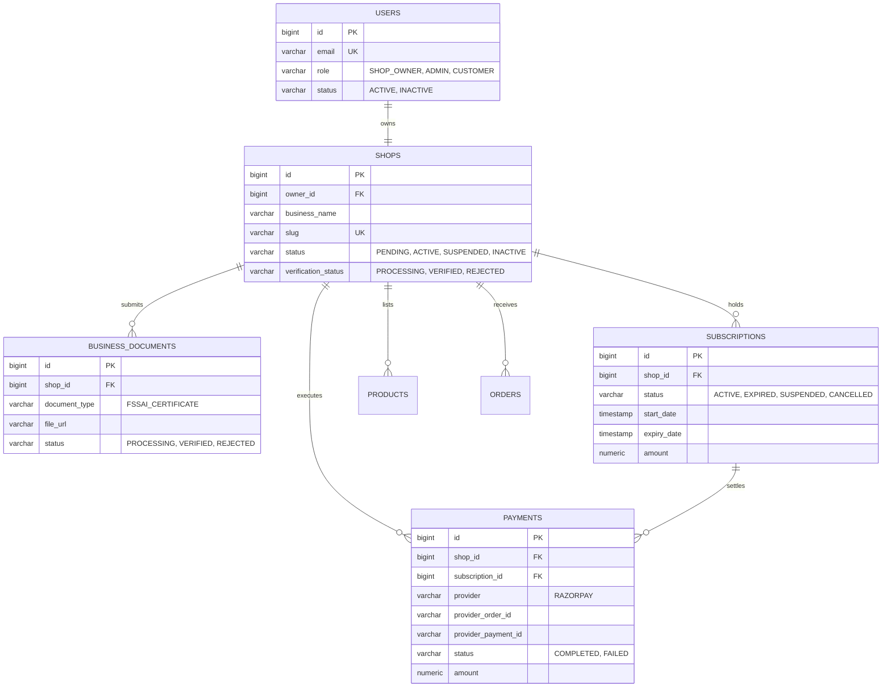
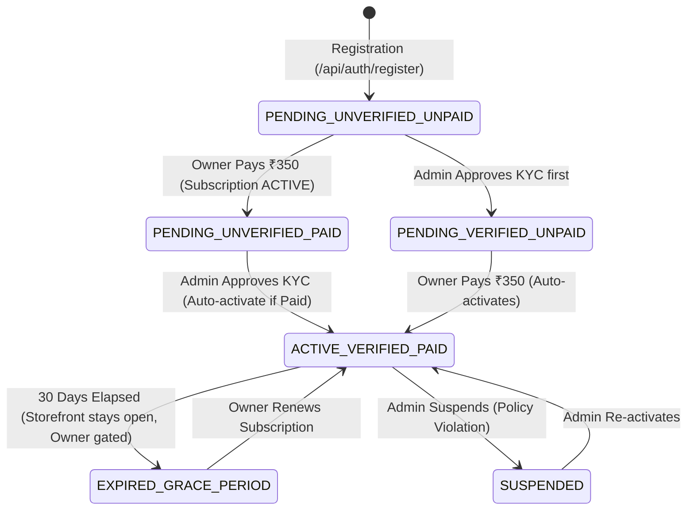

# CAKESTORE V1 — PHASE 1 PRE-IMPLEMENTATION AUDIT
## Existing Bakery Registration → Payment → Admin Approval → Go-Live

> **Audit Type**: Technical Pre-Implementation Audit (Read-Only Codebase Inspection)  
> **Platform Version**: CakeStore V1 (Spring Boot 3.3.4 + Next.js 14 App Router + PostgreSQL + JPA)  
> **Date**: September 15, 2026  
> **Scope**: Target Flow: `Existing Registration → Bakery Account Created → Shop Created as PENDING → Subscription Payment ₹350/month → Payment Success → Admin Review/Approval → Approved → Owner completes store setup → Bakery goes LIVE → Customers can browse and order`

---

## Executive Summary

CakeStore V1 already has **90% of the core backend architecture** for bakery registration, subscription payments (Razorpay order creation, signature verification, and webhook handling), admin KYC review, and operational tenant isolation.

However, the **connective tissue between registration, payment, and admin approval is currently disconnected in the frontend and state machine**:
1. **Registration disconnects from Payment**: The onboarding wizard creates the user and shop (`PENDING`), but skips payment entirely and directs the owner to `/dashboard/owner` with a misleading "14-Day Free Trial" message.
2. **Owner Dashboard 403 Dead-End**: Because the shop is `PENDING`, unverified (`PROCESSING`), and has no active subscription, every operational API in `/dashboard/owner` returns `403 Forbidden` (`ShopAccessValidator`). The owner dashboard lacks an onboarding banner or status screen explaining why access is restricted.
3. **Approval-Activation Disconnect**: When an admin approves KYC documents via `reviewShopVerification`, the backend sets `verificationStatus = VERIFIED`, but does **not** check whether an active subscription exists to set `shop.status = ACTIVE`.
4. **Subscription Payment UI**: While backend endpoints `/api/owner/payments/initiate-subscription` and `/api/owner/payments/verify-subscription` exist for ₹350/month, the owner subscription page (`/dashboard/owner/subscription`) only has a mock checkout button wired up, without loading Razorpay's checkout modal (`window.Razorpay`).

---

## 1. Registration Flow Audit

### 1.1 Frontend Registration
- **Component**: `frontend_v2/app/onboarding/page.tsx`
- **Steps**:
  - **Step 1 (Account)**: Name, Email, Password, Phone.
  - **Step 2 (Bakery Profile)**: Bakery Name, Slug (auto-generated), Business Type, Tagline, Story/Description, Operating Hours.
  - **Step 3 (Location & Compliance)**: Address, City, State, Pincode, FSSAI Number, FSSAI Certificate file upload.
  - **Step 4 (Completion)**: UI display: *"Your Bakery is Live! 🎉 Start Your Free 14-Day Trial"*. Button redirects to `/dashboard/owner`.
- **API Call**: `authApi.register(formData)` in `frontend_v2/services/api.ts` submits a `multipart/form-data` request containing `data` (JSON string) and optional `fssaiCert` (File).
- **Auto-Login**: On HTTP 200/201 response, `onboarding/page.tsx` calls `login(data.token, data.user)` and transitions directly to Step 4.

### 1.2 Backend Registration
- **Controller**: `com.cakeplatform.api.modules.auth.AuthController.register(...)`
- **Service**: `com.cakeplatform.api.modules.auth.AuthService.register(...)`
- **Entities Created**:
  1. **User**:
     - `role`: `UserRole.SHOP_OWNER`
     - `status`: `UserStatus.ACTIVE`
     - `email`: Normalized lowercase, uniqueness validated against database.
     - `password`: BCrypt hashed.
  2. **Shop**:
     - `owner`: Linked to the newly created `User`.
     - `businessName`: Provided name.
     - `slug`: Unique slug generated from business name.
     - `status`: `ShopStatus.PENDING` (Default)
     - `verificationStatus`: `VerificationStatus.PROCESSING` (Default)
     - `address`, `city`, `state`, `pincode`, `phone`, `email`: Saved from form.
  3. **Business Document**:
     - If `fssaiCert` file or FSSAI registration number is provided:
     - `documentType`: `DocumentType.FSSAI_CERTIFICATE`
     - `fileUrl`: Local storage path (`/uploads/documents/...`)
     - `status`: `VerificationStatus.PROCESSING`
  4. **Admin Notifications Dispatched**:
     - `AdminNotificationType.NEW_BAKERY`
     - `AdminNotificationType.BAKERY_AWAITING_APPROVAL`
     - `AdminNotificationType.VERIFICATION_SUBMITTED`
- **Response Payload**:
  - JWT token containing claims: `userId`, `email`, `role: "SHOP_OWNER"`, `shopId`, `shopStatus: "PENDING"`, `subscriptionStatus: "NONE"`.

### 1.3 Gaps & Disconnects in Registration
- **Misleading Step 4**: Claims the bakery is "Live" with a "14-Day Free Trial", but no free trial subscription record is ever created in the database, and `shop.status` is strictly `PENDING`.
- **No Payment Hook**: The registration flow ends at Step 4 without asking for or collecting the ₹350 subscription payment.

---

## 2. Subscription & Payment Flow Audit

### 2.1 Subscription Plans
- **Database Table**: `subscription_plans`
- **Hardcoded Plan in Backend**:
  - Located in `com.cakeplatform.api.modules.payment.OwnerPaymentController`:
    - `MONTHLY`: ₹350.00 (`new BigDecimal("350.00")`, 30 days)
    - `YEARLY`: ₹3500.00 (`new BigDecimal("3500.00")`, 365 days)
  - Plan name: *"Standard Bakery License"*

### 2.2 Payment Integration (Razorpay)
- **Order Initiation Endpoint**:
  - `POST /api/owner/payments/initiate-subscription`
  - Accepts `{ billingCycle: "MONTHLY" | "YEARLY" }`.
  - Resolves authenticated owner's shop via `shopAccessValidator.getShopByOwnerId(userId)`.
  - Calls `RazorpayService.createOrder(amount, "INR", receipt, notes)`.
  - Returns: `{ orderId, amount: 35000, currency: "INR", keyId, shopId, billingCycle }`.
- **Payment Verification Endpoint**:
  - `POST /api/owner/payments/verify-subscription`
  - Accepts `{ razorpayOrderId, razorpayPaymentId, razorpaySignature, billingCycle }`.
  - Validates HMAC-SHA256 signature using `razorpay.key_secret`.
  - Calls `SubscriptionService.processSuccessfulPayment(...)`.
- **Webhook Endpoint**:
  - `POST /api/webhooks/razorpay` in `WebhookController.java`.
  - Verifies signature using `razorpay.webhook_secret`.
  - Handles `payment.captured`.
  - Extracts `subscription_shop_id` or `shop_id` from metadata notes and calls `subscriptionService.processSuccessfulPayment(...)` idempotently.
- **Mock Checkout Endpoint**:
  - `POST /api/owner/payments/mock-checkout`
  - Allows local/testing bypass without live Razorpay keys.

### 2.3 Subscription Activation Logic
- **Service**: `com.cakeplatform.api.modules.subscription.SubscriptionService.processSuccessfulPayment(...)`
  ```java
  // 1. Create or extend Subscription
  Subscription subscription = ...
  subscription.setStatus(SubscriptionStatus.ACTIVE);
  subscription.setStartDate(now);
  subscription.setExpiryDate(now.plusDays(30)); // or 365
  
  // 2. Record Payment
  Payment payment = new Payment();
  payment.setAmount(amount);
  payment.setStatus("COMPLETED");
  payment.setProvider("RAZORPAY");
  
  // 3. Shop Activation Rule (Lines 81-88):
  if (shop.getStatus() == ShopStatus.SUSPENDED) {
      log.info("Shop is SUSPENDED. Subscription renewed but shop remains SUSPENDED.");
  } else if (shop.getVerificationStatus() == VerificationStatus.VERIFIED) {
      shopStatusManager.activateShop(shop.getId(), userId);
  } else {
      log.info("Shop is not VERIFIED (status: {}). Subscription renewed but shop remains non-active pending KYC.",
              shop.getVerificationStatus());
  }
  ```

### 2.4 Gaps & Disconnects in Subscription / Payment
- **Target Flow Mismatch**: In the target flow, the owner pays ₹350 **before** admin approval. When payment completes:
  - `Subscription` becomes `ACTIVE`.
  - But `shop.verificationStatus` is still `PROCESSING`.
  - Therefore, line 86 correctly leaves `shop.status` as `PENDING`.
- **Owner Subscription Page Missing Live Razorpay Modal**:
  - In `frontend_v2/app/dashboard/owner/subscription/page.tsx`, the button triggers `ownerApi.processMockSubscriptionPayment(amount)`.
  - The real Razorpay script (`https://checkout.razorpay.com/v1/checkout.js`) is only loaded on customer checkout (`/checkout/page.tsx`), not in the owner portal.

---

## 3. Admin Approval Flow Audit

### 3.1 Admin Dashboard Pages
- **Shop List**: `frontend_v2/app/admin/shops/page.tsx`
  - Filter tabs: `ALL`, `PENDING`, `ACTIVE`, `SUSPENDED`.
  - Displays: Bakery Name, Owner, Contact, City, Status badge, Verification badge, Joined Date.
  - Action buttons: "View Details", "Change Status".
- **Shop Detail & KYC Review**: `frontend_v2/app/admin/shops/[id]/page.tsx`
  - Displays business profile, contact, address, operating hours.
  - Displays KYC Document section: Document Type (`FSSAI_CERTIFICATE`), preview/download link, current document status (`PROCESSING`, `VERIFIED`, `REJECTED`).
  - Action buttons:
    - "Approve Verification" (modal confirmation).
    - "Reject Verification" (modal with mandatory reason text input).
    - "Update Shop Status" (`ACTIVE`, `INACTIVE`, `SUSPENDED` with mandatory reason).

### 3.2 Admin Backend APIs
- **Controller**: `com.cakeplatform.api.modules.admin.controller.AdminDashboardController`
- **Service**: `com.cakeplatform.api.modules.admin.AdminDashboardService`
- **Endpoints**:
  - `GET /api/admin/dashboard/stats`: Returns pending shops count (`pendingShops`).
  - `GET /api/admin/shops`: Paginated shops with search, status filters.
  - `GET /api/admin/shops/{shopId}`: Full shop detail with owner, documents, subscriptions, payments.
  - `PATCH /api/admin/shops/{shopId}/verification`:
    - Body: `{ action: "APPROVE" | "REJECT", reason: string }`
    - Calls `adminDashboardService.reviewShopVerification(...)`.
  - `PATCH /api/admin/shops/{shopId}/status`:
    - Body: `{ status: "ACTIVE" | "INACTIVE" | "SUSPENDED", reason: string }`
    - Calls `adminDashboardService.updateShopStatus(...)`.

### 3.3 What Happens on Admin Approval?
In `AdminDashboardService.java` (lines 243–250):
```java
if (action.equalsIgnoreCase("APPROVE")) {
    shop.setVerificationStatus(VerificationStatus.VERIFIED);
    shopRepository.save(shop);

    for (BusinessDocument doc : docs) {
        doc.setStatus(VerificationStatus.VERIFIED);
        businessDocumentRepository.save(doc);
    }
    ...
}
```
> [!CRITICAL]
> **Key Finding**: Admin KYC Approval (`reviewShopVerification`) updates `shop.verificationStatus` to `VERIFIED`, but **does NOT update `shop.status` from `PENDING` to `ACTIVE`**, even if the shop has already paid and has an active subscription!  
> For the shop to become `ACTIVE`, the admin currently has to perform a second manual action: open the "Change Status" modal and select "ACTIVE".

---

## 4. Owner Access & Gating Audit

### 4.1 Backend Security Gating
- **Component**: `com.cakeplatform.api.modules.security.ShopAccessValidator`
- **Method 1: `getShopByOwnerId(ownerId)`**
  - Basic tenant isolation. Verifies the shop belongs to the logged-in owner.
  - Does **not** block if unverified, pending, or expired.
  - Used by:
    - `OwnerPaymentController` (`/api/owner/payments/**`): Invoices, subscription status, checkout initiation.
    - `NotificationController` (`/api/notifications/**`).
- **Method 2: `getValidShopForOwner(ownerId)`**
  - Strict operational gating.
  - Throws `SubscriptionExpiredException` (HTTP 403) under any of the following conditions:
    1. `shop.status == SUSPENDED` → *"Shop is suspended by administration. Please contact support."*
    2. `shop.verificationStatus != VERIFIED` → *"Shop is not verified yet."*
    3. No subscription found, or subscription `EXPIRED`, `SUSPENDED`, `CANCELLED`, or past `expiryDate` → *"Subscription is EXPIRED. Please renew to access this feature."*
    4. `shop.status != ACTIVE` → *"Shop is currently PENDING. Please activate your subscription."*
  - Used by all operational controllers:
    - `OwnerProductController` (`/api/owner/products/**`)
    - `OwnerOrderController` (`/api/owner/orders/**`)
    - `OwnerAnalyticsController` (`/api/owner/analytics/**`)
    - `OwnerDeliveryConfigController` (`/api/owner/delivery-configs/**`)
    - `OwnerDiscountController` (`/api/owner/discounts/**`)
    - `OwnerReviewController` (`/api/owner/reviews/**`)
    - `OwnerShopController` (`/api/owner/shop` updates)

### 4.2 Owner Access State Matrix

| State / Condition | Shop Status | Verification Status | Subscription | Owner Operational APIs (`/products`, `/orders`) | Owner Payment APIs (`/payments`) | Owner Dashboard UI Behavior |
| :--- | :--- | :--- | :--- | :--- | :--- | :--- |
| **1. Just Registered** | `PENDING` | `PROCESSING` | None | ❌ Blocked (403: "Shop is not verified yet") | ✅ Allowed | UI crashes or shows generic error alert on data load |
| **2. Paid, Awaiting Approval** | `PENDING` | `PROCESSING` | `ACTIVE` | ❌ Blocked (403: "Shop is not verified yet") | ✅ Allowed | UI crashes or shows generic error alert on data load |
| **3. KYC Approved, Unpaid** | `PENDING` | `VERIFIED` | None | ❌ Blocked (403: "No subscription found") | ✅ Allowed | UI crashes or shows generic error alert on data load |
| **4. Approved + Paid (Live)** | `ACTIVE` | `VERIFIED` | `ACTIVE` | ✅ Fully Accessible | ✅ Allowed | Fully operational |
| **5. Subscription Expired** | `ACTIVE` | `VERIFIED` | `EXPIRED` | ❌ Blocked (403: "Subscription is EXPIRED") | ✅ Allowed | Shows subscription expired banner / renew prompt |
| **6. Admin Suspended** | `SUSPENDED` | Any | Any | ❌ Blocked (403: "Shop is suspended") | ✅ Allowed | Completely locked out of store operations |

### 4.3 Frontend Owner Experience Gap
- `frontend_v2/app/dashboard/owner/layout.tsx` does **not** inspect `shopStatus` or `verificationStatus`.
- If a new owner logs in right after registration, navigating to `/dashboard/owner` loads the dashboard shell, but individual pages attempt to fetch stats, orders, and products, which immediately fail with 403.
- There is no dedicated **"Onboarding Status / Awaiting Approval / Complete Payment"** screen or banner in the owner portal.

---

## 5. Customer Storefront Visibility Audit

### 5.1 Storefront Service Rules
- **Component**: `com.cakeplatform.api.modules.storefront.CustomerStorefrontService`
- **Core Guard**: `getActiveShop(shopId)`:
  ```java
  private Shop getActiveShop(Long shopId) {
      Shop shop = shopRepository.findById(shopId)
              .orElseThrow(() -> new RuntimeException("Shop not found with id: " + shopId));
      if (shop.getStatus() != ShopStatus.ACTIVE) {
          throw new RuntimeException("Shop is currently unavailable");
      }
      return shop;
  }
  ```

### 5.2 Customer Interaction Matrix Across States

| Shop Lifecycle State | Appears in Search / Directory (`/api/storefront/shops/search`) | Storefront Direct URL (`/shop/[id]`) | Product Browsing (`/api/storefront/shops/{id}/products`) | Cart & Guest Order Placement (`/api/storefront/orders`) |
| :--- | :--- | :--- | :--- | :--- |
| **`PENDING`** | ❌ Excluded | ❌ Blocked ("Shop is currently unavailable") | ❌ Blocked | ❌ Blocked |
| **`SUSPENDED`** | ❌ Excluded | ❌ Blocked ("Shop is currently unavailable") | ❌ Blocked | ❌ Blocked |
| **`INACTIVE`** | ❌ Excluded | ❌ Blocked ("Shop is currently unavailable") | ❌ Blocked | ❌ Blocked |
| **`ACTIVE`** | ✅ Visible | ✅ Accessible | ✅ Accessible | ✅ Allowed |

### 5.3 Subscription Expiry vs Suspension Behavior
- **Subscription Expiry**:
  - Handled by `SubscriptionService.expireSubscription(shopId)`.
  - Sets `subscription.status = SubscriptionStatus.EXPIRED`.
  - **Does NOT change `shop.status`**; `shop.status` remains `ACTIVE`.
  - **Result**: Existing customer orders and storefront browsing continue uninterrupted (grace period design), while the owner is blocked from modifying catalog or processing orders until renewed.
- **Admin Suspension**:
  - Handled by `ShopStatusManager.suspendShop(shopId, reason)`.
  - Sets `shop.status = ShopStatus.SUSPENDED`.
  - Invalidates storefront cache via `StorefrontCacheService.evictShopDetails(shopId)`.
  - **Result**: Immediately closes the storefront to all customers and locks out the owner.

---

## 6. Store Setup & "Go Live" Readiness Audit

### 6.1 Does "Go Live" Exist Today?
- **Finding**: **No.** There is no explicit "Publish Store" or "Go Live" button, nor is there a store setup completeness percentage/checklist.
- A bakery goes "Live" automatically the moment `shop.status` transitions to `ACTIVE`.

### 6.2 Available Store Setup Sections in Codebase
Once a bakery owner has operational access, the following configuration areas exist:
1. **Bakery Profile & Branding** (`/dashboard/owner/settings`):
   - Logo, Banner, Bio, Address, Social Links, Brand Colors.
2. **Operating Hours & Delivery Config** (`/dashboard/owner/delivery`):
   - Operating days, slot timings, delivery radius (km), minimum order value, base delivery charge.
3. **Product Catalog** (`/dashboard/owner/products`):
   - Product categories, cake variants, eggless toggle pricing, weights, images.

### 6.3 Risk Identified
If an admin approves a bakery and activates it before the owner adds any cakes or delivery slots, customers navigating to that bakery's storefront will encounter an empty store with no products and zero delivery options.

---

## 7. Database Schema & Lifecycle State Machine

### 7.1 Entity Relationship Diagram



### 7.2 Lifecycle State Transitions



---

## 8. Multi-Tenancy & Security Scoping

- **Authentication**: Stateless JWT with HMAC-SHA256. Owner JWT claims include `userId` and `role: "SHOP_OWNER"`.
- **Tenant Scoping**:
  - `ShopAccessValidator.getShopByOwnerId(userId)` ensures that every query to products, orders, discounts, reviews, and delivery configs is explicitly constrained by `shop.getId() == authenticatedShopId`.
  - There is zero cross-tenant leakage. Owner A cannot query or mutate Owner B's products or orders.
- **Admin Scope**:
  - `AdminDashboardController` routes require `role == "ADMIN"`.
  - Admins have read and write capabilities across all shops and documents.

---

## 9. Comprehensive Gaps & Friction Table

| # | Flow Stage | Existing Implementation | What Works | What Is Missing / Broken | Recommended Action for Phase 1 |
| :- | :--- | :--- | :--- | :--- | :--- |
| **1** | **Registration Wizard** | 4-step wizard in `app/onboarding/page.tsx` | Step 1–3 collects details, uploads FSSAI, creates user & shop in DB | Step 4 displays *"Your Bakery is Live! 14-day trial"* and redirects to dashboard, skipping payment entirely | Connect Step 4 to the ₹350 Subscription Payment screen instead of false "Live" trial message |
| **2** | **Subscription Payment Gateway** | `OwnerPaymentController` has `/initiate-subscription` & `/verify-subscription` | Backend Razorpay order creation, HMAC signature verification, and webhook handlers work | Frontend `/dashboard/owner/subscription` only triggers mock payment; does not invoke Razorpay popup modal | Embed Razorpay checkout SDK (`window.Razorpay`) in owner subscription payment flow |
| **3** | **Admin Approval Activation** | `reviewShopVerification` in `AdminDashboardService.java` | Sets `verificationStatus = VERIFIED` on shop and all documents | Does **not** set `shop.status = ACTIVE` if subscription is already active. Admin must do a 2nd step to activate | In `reviewShopVerification(action == "APPROVE")`: check if active subscription exists; if yes, auto-set `shop.status = ACTIVE` |
| **4** | **Owner Dashboard Gating UI** | `ShopAccessValidator.java` blocks operational endpoints (403) | Backend strictly prevents unapproved/unpaid shops from operations | Frontend dashboard shell loads, but inner pages fail with unhandled 403 errors | Add an Onboarding/Status Banner or Stepper in owner dashboard explaining status (`Awaiting Verification`, `Payment Required`) |
| **5** | **Store Setup / "Go Live"** | Store profile, delivery config, and product catalogs exist | Owners can add cakes, prices, operating hours, delivery radius | No checklist or warning if shop goes live with zero products or unconfigured delivery | Provide a simple setup checklist (Branding, Delivery Config, First Product) before advertising store URL |

---

## 10. Audit Rating & Phase 1 Execution Sequence

### Component Readiness Ratings

- **GREEN (Solid, Fully Functional)**:
  - Multi-tenant data model and owner scoping.
  - User and Shop creation with correct initial statuses (`PENDING`, `PROCESSING`).
  - Document upload and storage (`FSSAI_CERTIFICATE`).
  - Razorpay order initiation, signature verification, and webhook handling in backend.
  - Admin shop list, detail view, and KYC approve/reject modals.
  - Customer storefront gating (`getActiveShop` blocks non-ACTIVE shops).
- **YELLOW (Working Backend, Minor Frontend/Wiring Required)**:
  - Razorpay payment modal trigger on frontend (backend is 100% ready; frontend needs `Razorpay` modal script integration).
  - Admin approval auto-activation logic (single-line check in `reviewShopVerification`: if subscription active, activate shop).
- **RED (Broken / Missing Connective Flow)**:
  - Onboarding Step 4 connects to nowhere (falsely claims store is live instead of prompting for ₹350 payment).
  - Owner dashboard missing Pending/Approval status banner (resulting in raw 403 errors for new owners).
- **GRAY (Deferred / Out of Scope for Phase 1)**:
  - Complex multi-tiered subscription plans (stick with ₹350/mo standard license).
  - Automated FSSAI OCR verification (manual admin review works cleanly).

---

### Recommended Phase 1 Implementation Sequence

```
Step 1: Backend Alignment
└── Update AdminDashboardService.reviewShopVerification:
    When action == "APPROVE", if shop has an ACTIVE subscription, automatically activate shop (shopStatusManager.activateShop).

Step 2: Onboarding Flow Wiring
└── In frontend_v2/app/onboarding/page.tsx:
    Replace Step 4 ("Trial") with Step 4 ("Subscription Payment - ₹350/month").
    Integrate Razorpay checkout modal. On payment success, proceed to Step 5 ("Under Review").

Step 3: Owner Dashboard Status Banner
└── In frontend_v2/app/dashboard/owner:
    Add a top notification banner:
    - If PENDING & Paid: "Your verification is currently under review by CakeStore admin."
    - If UNPAID: "Please complete your ₹350/month subscription to proceed."

Step 4: Store Setup & Readiness Verification
└── Verify that when admin clicks "Approve", shop automatically transitions to ACTIVE.
└── Owner can then add first product and delivery slot, and the store appears live on storefront!
```
